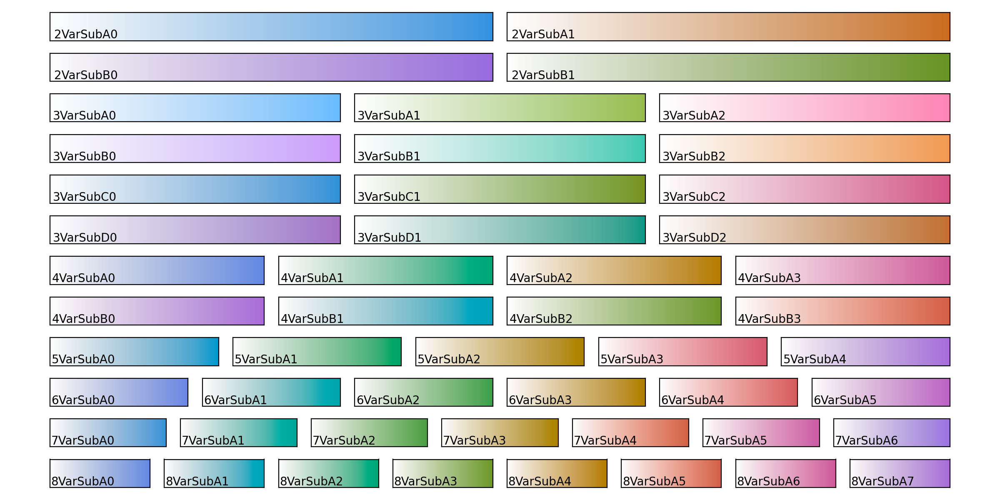
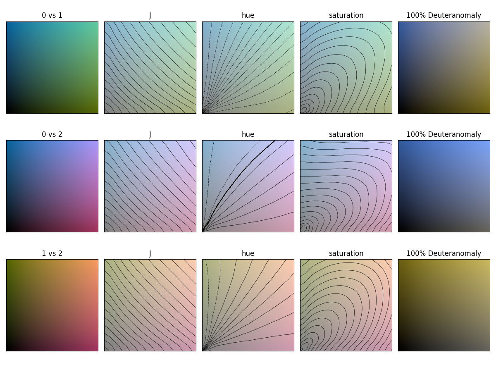

# multivariate_colormaps
Multivariate colormaps for use in matplotlib.
The colorbars are designed to combine well in sRGB when used to plot multivariate data, and be perceptually linear.

The colorbars exist in additive:

and subtractive versions:

The design criteria for these are as follows:
1. The colormaps must originate in a perceptually uniform colorspace*
2. The colormaps must be evenly spaced in colorspace
3. The orientation of the colormaps in the colorspace should be done to accomodate users with reduced color vision to the best extent possible**
4. When two opposing colormaps are combined, they should form a greyscale in sRGB space***

Variant **A** and **B** have different orientation in the colorspace. Variants **C** and **D** are brighter versions of **A** and **B**.

For the binary and trinary **A** and **B** variants, there is an additional requirement that they should form white (or black) when combined in full.

*The colormaps are generated from the ‘CAM02-LCD’ colorspace as defined in the package colorspacious (https://pypi.org/project/colorspacious/)

**The folder _comlormap_plots_ contain visualizations of how the individual colormaps are percieved by users with reduced color vision, i.e. below for _3VarAddC_ 
Note that deuteranomaly and protanomaly are relatively common while tritanomaly is relatively rare. See also: https://colorspacious.readthedocs.io/en/latest/tutorial.html#simulating-colorblindness 

***The folder _comlormap_plots_ also contain evaluations of how the colormaps combine, below for _3VarAddC_. 
This is the **C** version, and therefore has excessive saturation. i.e. when the ends of two colormaps are combined, the corresponding hue cannot be represented in sRGB space.

The **A** version (_3VarAddA_) does not exceed sRGB for any combination of the colormaps:

